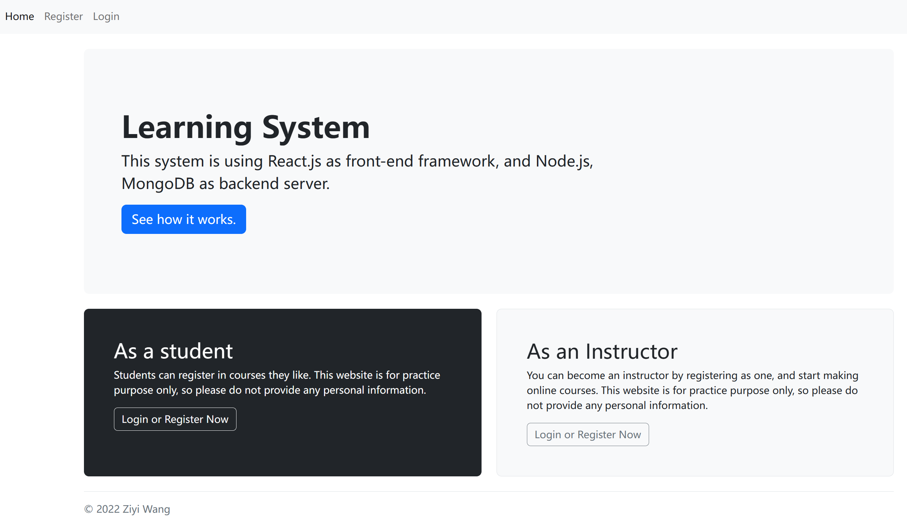
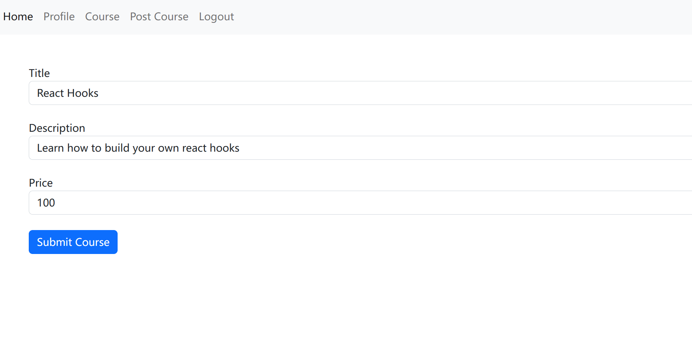
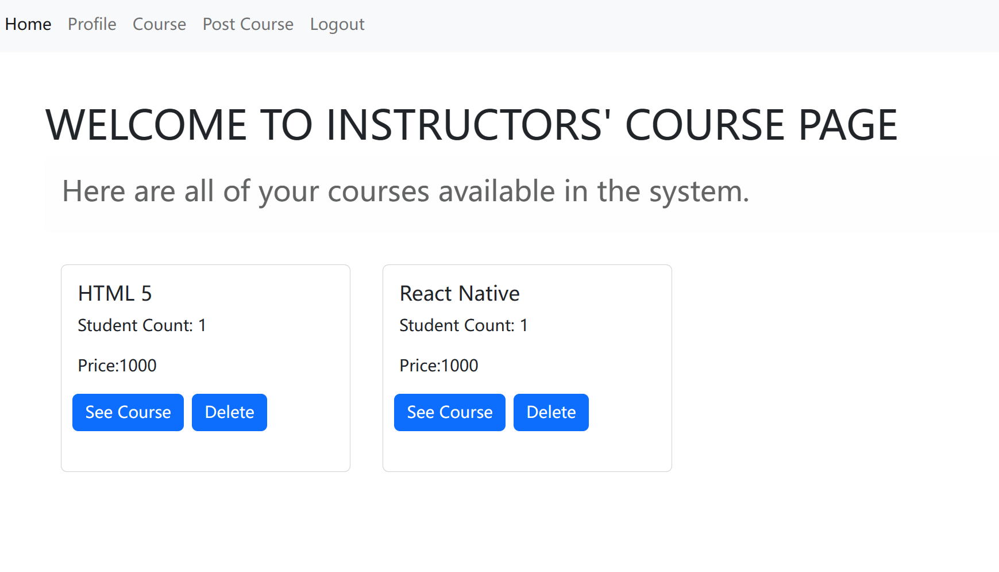
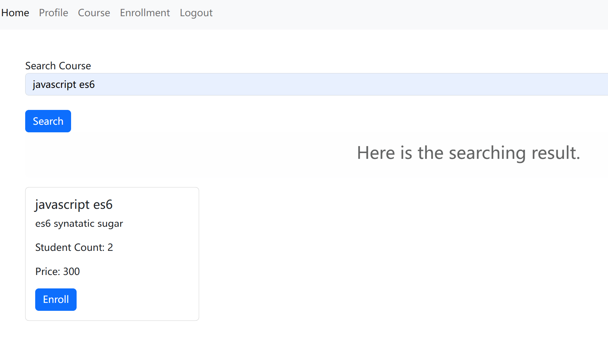

# Environment setting

```sh
npm install --dependencies
```
Please create .env in the server folder, then declare and initialize two variables: "DB_CLUSTER" and "MYSECRET"

# Description

Feel free to explore this system and all the buttons.

1. Home page and Nav bars:

   

   Click "Login or Register Now" at home page or "Login" on nav bars as a student or an instructor to log into the system. If you don't have an account, go the the "Register" page to sign up first. You can choose to register an instuctor or a student account during registration.

2. Publish new courses as an instructor:

   

   After logging in by an instructor account, Navbars will present all the functions instructors may use. Go to the "Post Course" page, fill in the forms and submit, then the courses will be successfully published. At the "Course" page you can manage all your available courses.

   

3. Enroll new courses as a student:

   

   After logging in by a student account, Navbars will present all the functions students may use. Go to the "Enrollment" page, fill in the form and search, then all relevant courses will be listed in the result. At the "Course" page you can see all the courses you have enrolled.

   
